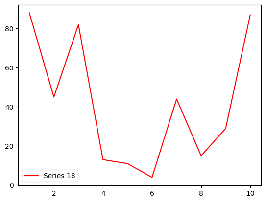

这一本书，让我写了整整一个月！！！这是用来给我们班级同学全面复习Pandas用的。这本书的图片以上传图床的方式呈现，但是可惜图片的显示有些问题，如果看不清，点进去可以在[Postimages](https://postimages.org)中阅览高解析度的图片。


# **预备知识：Python语法复习拓展**

这里我会讲述一些Python语法拓展，并复习之前的部分内容，这样可以帮助你更好的、更高效的编写代码，并且加深你对Python这门语言的理解。

本书使用了一些这些语法，因为这些语法本身提高了可读性和编写效率。

## **类型**

什么变量都有类型。在信息技术书中，只讲了Python的一些类型，如：

- `int`；
- `float`；
- `str`；
- `list`，即列表；
- `dict`，即字典；

谁知道，Python的类型无数，但实际上仍被分为了*两种*：

- ***值类型***；
- ***引用类型***；

下面对其进行讲述。

### **值类型**

***值类型***，即在变量中用实际值存储的类型。观察以下示例。


```python
x = 1
y = x

print(x, y)
y = 2
print(x, y)
```

    1 1
    1 2
    

可以看到，将`x`变量的值赋给`y`后，两个变量的值相等，修改`y`的值，再次输出，原来的`x`变量的值并没有发生改变。

有人问，难不成还能发生改变吗？真的可以。

### **引用类型**

观察下面的代码。看看和你猜测的结果是否一致。


```python
x = [1, 2, 3, 4, 5]
y = x

print("x:", x)
print("y:", y)

print("modifying x[0] to 999")
x[0] = 999

print("x:", x)
print("y:", y)

print("modifying y[1] to 888")
y[1] = 888

print("x:", x)
print("y:", y)
```

    x: [1, 2, 3, 4, 5]
    y: [1, 2, 3, 4, 5]
    modifying x[0] to 999
    x: [999, 2, 3, 4, 5]
    y: [999, 2, 3, 4, 5]
    modifying y[1] to 888
    x: [999, 888, 3, 4, 5]
    y: [999, 888, 3, 4, 5]
    

奇怪了。修改的明明是`x`的第一个值，为什么`y`的值也被修改了？而且更奇怪的是，修改了`y`的第二个值，反而把`x`的第二个值修改了？肯定有蹊跷。

*(请多次细读)*

是有蹊跷。列表在Python中是***引用类型***，对于已存在的数据，将其赋值给一个变量将会 ***创建指向这个数据的引用***。实际上，`x`实际上是一个类似于路标的东西（就是*指针*，一种底层的数据类型，用来指向内存中的数据），***对于程序中所有对`x`的访问最终被指向（重定向，可以这么理解）到内存中的实际值***。

将`x`的“值”赋给`y`实际上只是把`x`的方向“告诉”给了`y`，***让`x`和`y`指向同一块内存***，所以，所有对`y`的访问最终仍然是对内存中实际值的访问，所有的`print`语句都***读取***了实际值，而`x[]` `y[]`等赋值操作都***写入***了实际值。所以两个`print`语句输出的一定是一致的。

用形象一点的图表示。


|        原来      |      赋值时        |     后来         |
|:----------------:|:-----------------:|:----------------:|
| |  |  |


现在，对于选择题中“方括号里应该填什么”的问题，不应该再错了。

## **元组及其赋值操作**

使用一对（可选的）圆括号来包围以逗号相隔的值组成的值称为***元组（tuple）***。元组对我们来说，既是一个新的概念，也是一个我们见过的语法。因为我们在交换两个值时就会用它：


```python
m = 1
n = 2
print(m, n)
m, n = n, m
print(m, n)
```

    1 2
    2 1
    

怎么创建空元组呢？使用一个圆括号便可以创建一个空元组：


```python
tuple_2 = ()
print(tuple_2)
print(type(tuple_2))
```

    ()
    <class 'tuple'>
    

但若要创建一个元素的元组，用括号围住，就会和括号包围住的表达式产生混淆：


```python
maybe_tuple = (1)
print(maybe_tuple)
print(type(maybe_tuple))
```

    1
    <class 'int'>
    

此时需要在元素后面加上逗号（如`(X,)`），才不会产生混淆：


```python
must_tuple = (1,)
print(must_tuple)
print(type(must_tuple))
```

    (1,)
    <class 'tuple'>
    

元组有自己的输出。


```python
print((1, "hello", 3.2))
```

    (1, 'hello', 3.2)
    

元组的组成可以不加圆括号，但是，在函数参数里填入元组时，必须加上圆括号，以和函数参数区分开来。这样做是无效的：


```python
print(1, 2, 3)
```

    1 2 3
    

元组可以赋给一个变量。


```python
tuple_1 = (1, 2, 3)
#同样的操作： tuple_1 = 1, 2, 3
print(tuple_1)
```

    (1, 2, 3)
    

元组也可以被***解构***：


```python
(a, b, c) = tuple_1
print("a:", a)
print("b:", b)
print("c:", c)
```

    a: 1
    b: 2
    c: 3
    

元组是值类型，但是在其中包含的类型不变，所以这样子是无效的：


```python
(1, 2, 3) = (3, 4, 5)
```


      Cell In[84], line 1
        (1, 2, 3) = (3, 4, 5)
        ^
    SyntaxError: cannot assign to literal
    


### **访问一个元组**

使用方括号可以访问一个元组中的内容：


```python
tuple_2 = (1, 2, 3)
print(tuple_2[0])
```

也可以使用`len`量度一个元组的大小：


```python
print(len(tuple_2))
```

***试图修改元组是无效的***，但*若其中包含的类型允许，可以修改其中的值*：


```python
tuple_3 = ([1, 2, 3], 4)
print("tuple_3:", tuple_3)
tuple_3[0][0] = 3
print("tuple_3:", tuple_3)
```

注意，此处我们并没有把`[1, 2, 3]`赋给一个变量，但因为内存中实际存在这个数据，所以***可以修改一个没命名的数据！神奇吧！***

一个鲜有人知的语法点是，一个列表可以赋值给一个“列表”。观察下面的示例。


```python
[a, b] = [1, 2]

list_1 = [1, 2, 3]
[c, d, e] = list_1

print(a, b, c, d, e)
```

    1 2 1 2 3
    

注意实际上`[a, b]`和`[c, d, e]`本身并没有组成一个列表，只是长这样，了解一下。

所以，现在可以判断为什么下面这么合理的代码会报错了：


```python
a = 1, b = 2
print(a, b)
```


      Cell In[86], line 1
        a = 1, b = 2
            ^
    SyntaxError: cannot assign to literal
    


这是因为，`1, b`被组成了一个元组，所以这段代码试图用一个`2`对一个元组`(1, b)`赋值，也就是说，上面的代码，等价于：


```python
a = (1, b) = 2
print(a, b)
```


      Cell In[159], line 1
        a = (1, b) = 2
            ^
    SyntaxError: cannot assign to literal
    


## **列表，和列表内循环**

这是我们熟悉的列表。


```python
[1, 2, 3, 4, 5]
```

那么，这又是什么玩意？

```python
[x for x in range(100)]
```

这是***列表内循环***，用来构造一个列表。其中第一个`x`是组成列表的表达式，由循环变量组成，第二个`x`是循环变量的声明，与我们熟悉的`for`循环类似，通过`for`循环的执行让表达式的值不断更新，以此组成列表。

试试看。


```python
print([x for x in range(100)])
```

列表内还可以包含双层循环。相当于两个循环的嵌套，可以组成更多的值：


```python
print([(x, y) for x in range(10) for y in range(10)])
```

    [(0, 0), (0, 1), (0, 2), (0, 3), (0, 4), (0, 5), (0, 6), (0, 7), (0, 8), (0, 9), (1, 0), (1, 1), (1, 2), (1, 3), (1, 4), (1, 5), (1, 6), (1, 7), (1, 8), (1, 9), (2, 0), (2, 1), (2, 2), (2, 3), (2, 4), (2, 5), (2, 6), (2, 7), (2, 8), (2, 9), (3, 0), (3, 1), (3, 2), (3, 3), (3, 4), (3, 5), (3, 6), (3, 7), (3, 8), (3, 9), (4, 0), (4, 1), (4, 2), (4, 3), (4, 4), (4, 5), (4, 6), (4, 7), (4, 8), (4, 9), (5, 0), (5, 1), (5, 2), (5, 3), (5, 4), (5, 5), (5, 6), (5, 7), (5, 8), (5, 9), (6, 0), (6, 1), (6, 2), (6, 3), (6, 4), (6, 5), (6, 6), (6, 7), (6, 8), (6, 9), (7, 0), (7, 1), (7, 2), (7, 3), (7, 4), (7, 5), (7, 6), (7, 7), (7, 8), (7, 9), (8, 0), (8, 1), (8, 2), (8, 3), (8, 4), (8, 5), (8, 6), (8, 7), (8, 8), (8, 9), (9, 0), (9, 1), (9, 2), (9, 3), (9, 4), (9, 5), (9, 6), (9, 7), (9, 8), (9, 9)]
    

## **字符串的格式化**

字符串的格式化非常有用，可以用来制表格，美化输出。

### **使用`%`运算符格式化字符串**

在字符串后使用取余`%`运算符，后接一个元组作为参数，可以对字符串进行格式化。观察下面的代码。


```python
print("hello %s!" % ("format"))
print("")
print("")
print("%10s %10s %10s" % ("name", "age", "score"))
print("")
print("%10s %10d %10.2f" % ("alice", 16, 57.135554))
print("%10s %10d %10.2f" % ("bob", 15, 64.5))
print("%10s %10d %10.2f" % ("mike", 21, 77.1354))
print("%10s %10d %10.2f" % ("dave", 18, 27.0))
print("%10s %10d %10.2f" % ("carol", 16, 37.315))
```

    hello format!
    
    
          name        age      score
    
         alice         16      57.14
           bob         15      64.50
          mike         21      77.14
          dave         18      27.00
         carol         16      37.31
    

可以看到字符串格式化的魅力，但是，在`%`运算符左边的字符串里，那些`%10d` `%10.2f` `%10s`是什么意思呢？

在字符串中使用`%`后带特定意义的数字、字母和符号的单位叫做***格式说明符***。有下列常用的格式说明符：

- `s`，代表输出字符串；
- `d`，代表输出十进制整数（*decimal*）；
- `f`，代表输出十进制浮点数；
- `e`，代表输出科学计数法的浮点数（如`3.73e+01`，代表$3.73\times{}10^{1}$）
- `o`，代表输出八进制整数（*octal*）；
- `x`，代表输出十六进制整数（*hexadecimal*）；

格式说明符和`%`之间不能有空格，而且必须小写。例如`% s` `%D`等都是错的，而例如`%s` `%d`等都是对的。

在格式说明符和`%`之间插入对齐和精度要求等，可以让输出对齐，并保留指定的小数位，以及其他要求。例如，`%10s`可以让输出的字符串靠右对齐，总长度为10：


```python
print("%10s" % ("abcde"))
print("^^^^^^^^^^")
```

         abcde
    ^^^^^^^^^^
    

而当输出的字符串超出对齐要求时，将不会截取字符串，而按原样输出：


```python
print("%10s" % ("abcdefghijklmno"))
print("^^^^^^^^^^")
```

    abcdefghijklmno
    ^^^^^^^^^^
    

当然，没有对齐要求，只有一个`%s`便可以输出，没有问题：


```python
print("%s" % ("abcde"))
```

    abcde
    

`f`说明符可以输出浮点数，在对齐要求（可选）的后面加上“`.位数`”便可以控制输出保留的***小数位数***（注意不是保留几位有效位）：


```python
print("%5.2f %.5f" % (3.14, 3.14159265358979))
```

     3.14 3.14159
    

第二个格式说明符没有对齐要求，只有一个`.5`，将不会对齐，仅保留5位有效位。

当然，格式化字符串不止这一种方法。

### ***使用f-string格式字符串（推荐）***

在字符串的引号（单引号，双引号，三引号）前面加`f`（例如`f""` `f''` `f'''` `f"""`，`f`和引号之间不能有空格）可以让一个字符串变成f-string，f-string给Python添加了一种更加可读的字符串格式化方式，增强了可用性。f-string使用花括号括住要输出的表达式，在输出时会把花括号的内容替换掉。观察：


```python
print(f"{10.1234}")
x = 1
y = 2
print(f"{x} + {y} = {x + y}")
```

    10.1234
    1 + 2 = 3
    

下面使用f-string来打印之前的表格。


```python
print(f'{"name" :>10} {"age" :>10} {"score" :>10}')
print("")
print(f'{"alice" :>10} {16 :>10} {57.135554 :>10.2f}')
print(f'{"bob" :>10} {15 :>10} {64.5 :>10.2f}')
print(f'{"mike" :>10} {21 :>10} {77.1354 :>10.2f}')
print(f'{"dave" :>10} {18 :>10} {27.0 :>10.2f}')
print(f'{"carol" :>10} {16 :>10} {37.315 :>10.2f}')
```

          name        age      score
    
         alice         16      57.14
           bob         15      64.50
          mike         21      77.14
          dave         18      27.00
         carol         16      37.31
    

f-string的格式说明符非常简洁，使用`>`向右对齐，使用`<`向左对齐，使用`^`向中间对齐。在对齐要求后面加上类似于`%`格式字符串的控制说明符也可以作同样的精度控制操作。

如果要在f-string中输出`}`和`{`字符需要使用两个花括号，否则会引起歧义而报错。输出引号（单引号、双引号）也需要适当的转义，否则也报错。观察：

```python
print(f"print(f\"{{x}} + {{y}} = {{x + y}}\") produces:\n{x} + {y} = {x + y}")
```

```
print(f"{x} + {y} = {x + y}") produces:
1 + 2 = 3
```


# **Pandas**

pandas是python的数据分析和处理库，可以方便的对大型数据，及其数据源进行操作。

其主要数据结构是Series和DataFrame。

## **Series**

Series是一种一维的数据结构，每一个Series都有index（索引），可以理解为字典的键（key），使用索引可以用来访问指定的数据，使用数字也可以对Series进行基于下标的数据访问，两者都是通过方括号，只是索引的类型不一样。

先导入需要的包，并设置pandas的对齐显示。


```python
import pandas as pd
import numpy as np
import matplotlib.pyplot as plt
pd.set_option("display.unicode.ambiguous_as_wide", True)
pd.set_option("display.unicode.east_asian_width", True)
```

### **使用`pd.Series`构造函数来创建Series数据结构**


```python
series_1 = pd.Series()
data_1 = [1, 2, 3, 4, 5, 6, 7, 8, 9]

series_2 = pd.Series(data_1)

print(series_1)
print(series_2)
```

    Series([], dtype: object)
    0    1
    1    2
    2    3
    3    4
    4    5
    5    6
    6    7
    7    8
    8    9
    dtype: int64
    

第一个`pd.Series`没有任何的参数，创建的是空Series对象，`data_1`里面是一个python列表，`pd.Series`构造函数可以接受任何的一维数据结构（细说的话，就是满足 *`array-like, Series, ndarray-like`或`ExtensionArray`* ）并相应的转换成Series对象。

可以看到，`pd.Series`构造函数对于没有特定索引值的数据，自动分配了从0开始的下标索引。

`dtype`的意思是Series中***数据的类型***，注意不是索引的类型。此时的`dtype`是`int64`，因为python对于程序里面的整数默认使用64位宽（$0$到$2^{64}-1$，也就是$0$到$18446744073709551615$）。

由于每个Series都有索引值，所以使用字典创建Series也在Pandas中得到了支持：


```python
data_2 = {
    "123" : "456",
    "789" : "012",
}

series_3 = pd.Series(data_2)

print(series_3)
```

    123    456
    789    012
    dtype: object
    

此时，`series_3`中的索引变成了`"123"`和`"456"`，而且由于值的类型是字符串（python的`str`对象），所以`dtype`的值变为了`object`。

除了用字典可以为Series分配索引，我们可以在`pd.Series`构造函数里面使用显式参数`index`来指定Series的索引值：


```python
print(data_1)

series_4 = pd.Series(data_1, index=[8, 7, 6, 5, 4, 3, 2, 1, 0])
print(series_4)
print(series_2)
```

    [1, 2, 3, 4, 5, 6, 7, 8, 9]
    8    1
    7    2
    6    3
    5    4
    4    5
    3    6
    2    7
    1    8
    0    9
    dtype: int64
    0    1
    1    2
    2    3
    3    4
    4    5
    5    6
    6    7
    7    8
    8    9
    dtype: int64
    

这里把`series_2`也打印了出来，可以看到索引值上的区别。

### **直接访问Series中的数据**

这里拓展一个Python的语法点，一个类型中可以有 *“属性”*，即看起来是变量（如下文的`some_series.values`）的东西称为类的*属性*。

但同时一个类也可以有*公有变量*，如下文的`some_series.index`。

任何一个Series都有以下属性：

- `T`属性用来*转置*（即将行列转$90^{\circ{}}$）一个数据结构；
- `array`属性用来得到Series的列表表示；
- `values`属性用来得到Series的ndarray表示；
- `dtype`属性用来得到Series的数据类型；
- `shape`属性用来得到Series的形状，作为元组返回，并且（根据Series的定义，）永远只有一个元素；
- `nbytes`属性用来得到Series中数据所占的内存大小，单位为字节；
- `ndim`属性用来得到Series的维度，并且（根据Series的定义，）恒为$1$；
- `size`属性用来得到Series中元素数量；
- `hasnans`属性，若Series中有任何无效（`NaN`）数据则为`True`，否则为`False`；
- `empty`属性，若Series中无元素则为`True`，否则为`False`；
- `name`属性，其中是Series的名字（等一下）；
- `index`属性，其中是Series的索引值。

同时Series还有`index`***变量***用来读取Series中的***索引值***。下面简要介绍一些这些变量和属性的用法。


```python
test_series = pd.Series([1, "spam", 3.2, False, np.nan],
                        name="a_test_series",
                        index=["foo", "bar", "baz", "qux", "cat"])

print(f"""
{test_series}

test_series.name: {test_series.name}
test_series.values: {test_series.values}
test_series.empty: {test_series.empty}
test_series.dtype: {test_series.dtype}
test_series.hasnans: {test_series.hasnans}
test_series.size: {test_series.size}
test_series.shape: {test_series.shape}
test_series.array: 
{test_series.array}

test_series.T: 
{test_series.T}

test_series.nbytes: {test_series.nbytes}
test_series.ndim: {test_series.ndim}
test_series.index: {test_series.index}
""")
```

    
    foo        1
    bar     spam
    baz      3.2
    qux    False
    cat      NaN
    Name: a_test_series, dtype: object
    
    test_series.name: a_test_series
    test_series.values: [1 'spam' 3.2 False nan]
    test_series.empty: False
    test_series.dtype: object
    test_series.hasnans: True
    test_series.size: 5
    test_series.shape: (5,)
    test_series.array: 
    <PandasArray>
    [1, 'spam', 3.2, False, nan]
    Length: 5, dtype: object
    
    test_series.T: 
    foo        1
    bar     spam
    baz      3.2
    qux    False
    cat      NaN
    Name: a_test_series, dtype: object
    
    test_series.nbytes: 40
    test_series.ndim: 1
    test_series.index: Index(['foo', 'bar', 'baz', 'qux', 'cat'], dtype='object')
    
    

Series是可以有名字的，在构造函数中使用`name`命名参数便可以指定名字。名字有什么用吗？当你从DataFrame中索引一个列时，Series便会有名字，是当前列的名字。使用`.values`属性可以访问Series的ndarray形式。使用`.array`可以访问Series的PandasArray形式。

`T`属性（因为Series的定义，）本身不对Series作任何的操作。

`nbytes`属性用来得到Series中数据所占的内存大小，单位为字节；

`ndim`属性用来得到Series的维度，即1；

使用`index`变量可以直接访问Series的索引值，并且可以修改。

使用`astype`方法可以将一个Series中的所有值转换为参数里指定的类型：


```python
series_float = pd.Series([1.0, 2.0, 3.0, 4.0])

print(series_float)
print(series_float.astype("int64"))
```

    0    1.0
    1    2.0
    2    3.0
    3    4.0
    dtype: float64
    0    1
    1    2
    2    3
    3    4
    dtype: int64
    

### **操作Series对象**

数据总是可以操作的，对于Series尤为如此。

我们可以修改Series中特定的值，先***拷贝***`series_2`中的数据到`series_5`变量中。


```python
series_5 = series_2.copy()
```

> 为什么需要用`> series_5 = series_2.copy()`，而不是`series_5 = series_2`呢？这是因为Series是python中的***类***，是引用类型，需要使用`copy()`方法来避免创建原来数据的引用。

下面所有示例我将使用`series_5.values`来将其中的值以ndarray的方式输出，以节省篇幅。

> ndarray是numpy中的数据格式，相当于对Python列表的拓展（这种说法是不专业的，但，可以先这么理解）。ndarray中的数据类型是固定的，而Series中的数据类型是可变的，比如，`series_5.values`中的数据类型是`object`，而`series_2.values`中的数据类型是`int64`。
>
> 使用`.values`可以将Series中的数据以ndarray的方式返回。


```python
series_5[0] = "foo"
series_5[1] = "bar"

print(series_5.values)
```

    ['foo' 'bar' 3 4 5 6 7 8 9]
    

注意，因为我之前使用`copy()`方法拷贝了原数据的副本，所以我并没有修改`series_2`的数据：


```python
print(series_2.values)
```

    [1 2 3 4 5 6 7 8 9]
    

> 注意，此处的`series_2.values`***是ndarray数据格式，不是Series***，所以不能采用Series中的*一些操作*（即使numpy有pandas Series的类似操作，但毕竟不能搞混）。

#### **修改Series中的值**

准备数据。`series_6`和`series_7`按原样输出，以观察*索引值*。


```python
series_6 = pd.Series(data_1, 
                     index=["foo", "bar", "baz", "qux", "sec", "oct", "min", "max", "avg"])
print(f"series_6.values: {series_6.values}")
print(f"series_6.index: {series_6.index.values}")

series_7 = pd.Series(data_1)
print(f"series_7.values: {series_7.values}")
print(f"series_7.index: {series_7.index.values}")
```

    series_6.values: [1 2 3 4 5 6 7 8 9]
    series_6.index: ['foo' 'bar' 'baz' 'qux' 'sec' 'oct' 'min' 'max' 'avg']
    series_7.values: [1 2 3 4 5 6 7 8 9]
    series_7.index: [0 1 2 3 4 5 6 7 8]
    

通过***索引值***可以修改一个元素。观察修改后输出的区别：


```python
series_6["min"] = 123
series_7[3] = 123

print(f"series_6.values: {series_6.values}")
print(f"series_6.index: {series_6.index.values}")
print(f"series_7.values: {series_7.values}")
print(f"series_7.index: {series_7.index.values}")
```

    series_6.values: [  1   2   3   4   5   6 123   8   9]
    series_6.index: ['foo' 'bar' 'baz' 'qux' 'sec' 'oct' 'min' 'max' 'avg']
    series_7.values: [  1   2   3 123   5   6   7   8   9]
    series_7.index: [0 1 2 3 4 5 6 7 8]
    

通过***下标***也可以修改一个元素：


```python
series_6[0] = 999
print(f"series_6.values: {series_6.values}")
print(f"series_6.index: {series_6.index.values}")
```

    series_6.values: [999   2   3   4   5   6 123   8   9]
    series_6.index: ['foo' 'bar' 'baz' 'qux' 'sec' 'oct' 'min' 'max' 'avg']
    

为什么不能用下标值修改`series_7`？因为`series_7`的***索引值***与**下标值**的类型相同（都是`int`），用`int`类型索引`series_7`正是**使用索引值访问数据，下标的功能便被覆盖了。**

#### **Series的运算**

##### **Series（向量）与标量操作**

通过`+`，`-`，`*`，`/`等运算符，可以对***Series（术语常称“向量”）***进行*逐元素*的运算，即，运算对于每一个数据都会应用一遍，首先是Series与***标量***（一个数据）相操作：


```python
series_8 = pd.Series([1, 2, 3, 4, 5, 6, 7, 8])

print(f"series_8 + 2:\n{(series_8 + 2).values}")
print(f"series_8 - 2:\n{(series_8 - 2).values}")
print(f"series_8 * 2:\n{(series_8 * 2).values}")
print(f"series_8 / 2:\n{(series_8 / 2).values}")
print(f"(series_8 / 2)'s dtype:\n{(series_8 / 2).dtype}")


```

    series_8 + 2:
    [ 3  4  5  6  7  8  9 10]
    series_8 - 2:
    [-1  0  1  2  3  4  5  6]
    series_8 * 2:
    [ 2  4  6  8 10 12 14 16]
    series_8 / 2:
    [0.5 1.  1.5 2.  2.5 3.  3.5 4. ]
    (series_8 / 2)'s dtype:
    float64
    

注意到由于相除运算的结果是浮点数，所以第四个输出（`series_8 / 2`）得到的Series的`dtype`为`float64`（即`double`，IEEE-754双精度浮点数）。

*几乎所有*Python中可以对数值干的事情，都可以对Series应用，也就是说，你可以：

- 用`==` `!=` `>=` `<=` `<` `>`等关系运算符让Series与标量（以及，Series）比较；
- 用`%`运算符取余数（术语常称，*“取模”*）；
- ...

同样的操作也可以***由Series中的方法来实现***：


```python
print(f"series_8 + 2 using methods:\n{series_8.add(2).values}")
print(f"series_8 - 2 using methods:\n{series_8.sub(2).values}")
print(f"series_8 * 2 using methods:\n{series_8.mul(2).values}")
print(f"series_8 / 2 using methods:\n{series_8.div(2).values}")

```

    series_8 + 2 using methods:
    [ 3  4  5  6  7  8  9 10]
    series_8 - 2 using methods:
    [-1  0  1  2  3  4  5  6]
    series_8 * 2 using methods:
    [ 2  4  6  8 10 12 14 16]
    series_8 / 2 using methods:
    [0.5 1.  1.5 2.  2.5 3.  3.5 4. ]
    

> 此处（`series_8 / 2 using methods`那行输出）的`1.` `2.` `3.` `4.`看起来很奇怪，因为我们对`series_8`调用`add` `sub` `mul` `div`时返回的是Series对象，对其应用`.values`便把其中的数据转换成了ndarray对象，而***numpy在输出ndarray中的浮点数时，只会输出有效位***，所以`1.0` `2.0`等数字中的`0`被去掉了，留下的只有`1.` `2.` `3.` `4.`。

得到的结果完全一致。因为Series只是对其实现中的类增加了相应的运算符重载，调用的便是这些方法。

可以用来计算的方法还有很多，例如有：

- `mod`用来取模，对应`%`运算符；
- `pow`用来乘方，对应`**`运算符；
- `round`用来四舍五入，对应`math.round`方法；
- `lt`代表小于，对应`<`运算符，（*less than*）用来比较左边和参数的大小，此外还有：
  - `gt`，大于，（*greater than*），对应`>`运算符；
  - `le`，小于等于，（*less or equals*），对应`<=`运算符；
  - `ge`，大于等于，（*greater or equals*），对应`>=`运算符；
  - `eq`，等于，（*equals*），对应`==`运算符；
  - `ne`，不等于，（*not equals*），对应`!=`运算符；
- `abs`用来取绝对值，对应`math.abs`方法，不需要参数；
- `mean`用来取平均值，不需要参数；
- `var`用来取方差，不需要参数；
- `std`用来取标准差，不需要参数；
- `sum`取和，不需要参数；
- `median`取中位数，不需要参数；

##### **Series（向量）与Series（向量）**

Series不仅可以与标量操作，也可以与另外一个Series操作，同样是使用相应的方法进行运算（`add` `sub` `mul` `div`等，或运算符`+` `-` `*` `/`等），但可以对两个向量中的元素***逐个操作***。这里创建另外一个Series，并将它们的值输出。


```python
series_9 = pd.Series([8, 7, 6, 5, 4, 3, 2, 1])
print(series_8.values)
print(series_9.values)
```

    [1 2 3 4 5 6 7 8]
    [8 7 6 5 4 3 2 1]
    

同样地使用运算符操作***两个向量（注意不是向量和标量了！）***`series_8`和`series_9`，观察结果：


```python
series_10 = series_8 + series_9
print(series_10.values)
```

    [9 9 9 9 9 9 9 9]
    

数据是凑过的，所以相当于等差数列逆序相加，和为$9$。

同样地运用其他***运算符***操作两个向量，观察：


```python
print((series_8 - series_9).values)
print((series_8 * series_9).values)
print((series_8 / series_9).values)
```

    [-7 -5 -3 -1  1  3  5  7]
    [ 8 14 18 20 20 18 14  8]
    [0.125      0.28571429 0.5        0.8        1.25       2.
     3.5        8.        ]
    

同样地运用其他***方法***操作两个向量，观察：


```python
print((series_8.add(series_9)).values)
print((series_8.sub(series_9)).values)
print((series_8.mul(series_9)).values)
print((series_8.div(series_9)).values)
```

    [9 9 9 9 9 9 9 9]
    [-7 -5 -3 -1  1  3  5  7]
    [ 8 14 18 20 20 18 14  8]
    [0.125      0.28571429 0.5        0.8        1.25       2.
     3.5        8.        ]
    

所以pandas的逻辑在我们的脑海里慢慢的熟悉起来了，要么是***一对多***，要么是***多对多***，永远是***逐项操作***。

当不同长度的Series互相操作时，缺的数据会变成`NaN`。观察：


```python
oops_1 = pd.Series([1, 2, 3, 4])
oops_2 = pd.Series([1, 2, 3])

print(oops_1 + oops_2)
```

    0    2.0
    1    4.0
    2    6.0
    3    NaN
    dtype: float64
    

#### **Series的排序**

使用`sort_values`或者`sort_index`可以依照Series中的 ***值*** 或 ***索引*** 对Series排序。

##### **`sort_values`：依照值来排序**

`sort_values`依照***值***对Series进行排序。下面是一个示例，创建一个有10个介于$(1,100)$之间的整数Series，输出原来数据和排序过的数据，观察区别：


```python
import random
series_10 = pd.Series([random.randint(1,100) for i in range(10)])
print(f"raw data: {series_10.values}")
print(f"sorted: {series_10.sort_values().values}")
```

    raw data: [62 17 12 70 51 27 42 34 93 29]
    sorted: [12 17 27 29 34 42 51 62 70 93]
    

通过指定命名参数`ascending`，可以制定排序的顺序。`ascending`接受一个布尔型值作为参数，

- 若为`True`，则按升序排序，这也是这个参数的默认值（在你未指定这个参数时）；
- 若为`False`，则按降序排序。

> 注意， ***`sort_values()`和下文的`sort_index()`函数都不会修改原来的值，而是返回一个新的Series对象。***

下面的示例把`series_10`再次调用`sort_values`，并指定`ascending`参数为`True`和`False`，观察区别：


```python
print(f"raw data: {series_10.values}")
print(f"sorted with ascending=True: {series_10.sort_values(ascending=True).values}")
print(f"sorted with ascending=False: {series_10.sort_values(ascending=False).values}")
```

    raw data: [54 44  5 32 57 34 91 74 94 30]
    sorted with ascending=True: [ 5 30 32 34 44 54 57 74 91 94]
    sorted with ascending=False: [94 91 74 57 54 44 34 32 30  5]
    

##### **`sort_index`：按照索引值来排序**

由于Series可以指定索引值，所以我们可以按照相应的方法按照***索引值的先后顺序***排序一个Series。这便是`sort_index`的作用。

下面创建两个含有十个元素的Series，指定索引值并调用`sort_index`，观察结果：


```python
series_11 = pd.Series([1, 2, 3, 4, 5, 6, 7, 8, 9, 10], 
                      index=[10, 9, 8, 7, 6, 5, 4, 3, 2, 1])
series_12 = pd.Series([1, 2, 3, 4, 5, 6, 7, 8, 9, 10], 
                      index=["foo", "bar", "baz", "qux", "min", "max", "yoo", "matt", "mike", "dave"])
print("series_11:")
print(f"\tseries_11.values: \n\t{series_11.values}")
print(f"\tseries_11.index: \n\t{series_11.index.values}")
print("using sort_index:")
print(f"\tseries_11.sort_index().values: \n\t{series_11.sort_index().values}")
print(f"\tseries_11.sort_index().index: \n\t{series_11.sort_index().index.values}")

print("series_12:")
print(f"\tseries_12.values: \n\t{series_12.values}")
print(f"\tseries_12.index: \n\t{series_12.index.values}")
print("after sort_index:")
print(f"\tseries_12.sort_index().values: \n\t{series_12.sort_index().values}")
print(f"\tseries_12.sort_index().index: \n\t{series_12.sort_index().index.values}")
```

    series_11:
    	series_11.values: 
    	[ 1  2  3  4  5  6  7  8  9 10]
    	series_11.index: 
    	[10  9  8  7  6  5  4  3  2  1]
    using sort_index:
    	series_11.sort_index().values: 
    	[10  9  8  7  6  5  4  3  2  1]
    	series_11.sort_index().index: 
    	[ 1  2  3  4  5  6  7  8  9 10]
    series_12:
    	series_12.values: 
    	[ 1  2  3  4  5  6  7  8  9 10]
    	series_12.index: 
    	['foo' 'bar' 'baz' 'qux' 'min' 'max' 'yoo' 'matt' 'mike' 'dave']
    after sort_index:
    	series_12.sort_index().values: 
    	[ 2  3 10  1  8  6  9  5  4  7]
    	series_12.sort_index().index: 
    	['bar' 'baz' 'dave' 'foo' 'matt' 'max' 'mike' 'min' 'qux' 'yoo']
    

可以看到，`sort_index`通过***索引值的类型排序的顺序***排序了`series_11`和`series_12`，由于`series_12`的索引值是字符串，所以`sort_index`依照***字典序***排序。

同时，`sort_index`也可以使用`ascending`命名参数来指定排序的顺序。观察：


```python
print("series_12:")
print(f"\tseries_12.values: \n\t{series_12.values}")
print(f"\tseries_12.index: \n\t{series_12.index.values}")
print("after sort_index with ascending=True:")
print(f"\tseries_12.sort_index(ascending=True).values: \n\t{series_12.sort_index(ascending=True).values}")
print(f"\tseries_12.sort_index(ascending=True).index: \n\t{series_12.sort_index(ascending=True).index.values}")
print("after sort_index with ascending=False:")
print(f"\tseries_12.sort_index(ascending=False).values: \n\t{series_12.sort_index(ascending=False).values}")
print(f"\tseries_12.sort_index(ascending=False).index: \n\t{series_12.sort_index(ascending=False).index.values}")
```

    series_12:
    	series_12.values: 
    	[ 1  2  3  4  5  6  7  8  9 10]
    	series_12.index: 
    	['foo' 'bar' 'baz' 'qux' 'min' 'max' 'yoo' 'matt' 'mike' 'dave']
    after sort_index with ascending=True:
    	series_12.sort_index(ascending=True).values: 
    	[ 2  3 10  1  8  6  9  5  4  7]
    	series_12.sort_index(ascending=True).index: 
    	['bar' 'baz' 'dave' 'foo' 'matt' 'max' 'mike' 'min' 'qux' 'yoo']
    after sort_index with ascending=False:
    	series_12.sort_index(ascending=False).values: 
    	[ 7  4  5  9  6  8  1 10  3  2]
    	series_12.sort_index(ascending=False).index: 
    	['yoo' 'qux' 'min' 'mike' 'max' 'matt' 'foo' 'dave' 'baz' 'bar']
    

#### **Series的筛选**

Series对象可以通过在方括号中加入布尔表达式，来筛选符合条件的元素。下面是若干示例。

接下来的示例创建一个等差Series，并筛选出其中的偶数，观察用法和结果：


```python
series_11 = pd.Series([x for x in range(1,11)])

print(f"raw data: {series_11.values}")
print(f"filtered: {series_11[series_11 % 2 == 0].values}")
```

    raw data: [ 1  2  3  4  5  6  7  8  9 10]
    filtered: [ 2  4  6  8 10]
    

##### **为什么可行？**

现在把`== 0`除去，观察式子`series_11 % 2`的值：


```python
print(f"series_11 % 2: \n{series_11 % 2}")
```

    series_11 % 2: 
    0    1
    1    0
    2    1
    3    0
    4    1
    5    0
    6    1
    7    0
    8    1
    9    0
    dtype: int64
    

仍然是`series_11`中每一个元素对2取余数的结果，组成了一个新的Series。

同样地，通过`==`运算符让`series_11 % 2`这个Series与0比较，获得一个布尔值的Series：


```python
print(series_11 % 2 == 0)
```

    0    False
    1     True
    2    False
    3     True
    4    False
    5     True
    6    False
    7     True
    8    False
    9     True
    dtype: bool
    

***可以使用Series来访问Series。*** 观察下面的代码结果。


```python
series_12 = pd.Series([1, 2, 3, 4, 5, 6, 7, 8, 9])
series_index_1 = pd.Series([1, 3, 5])
print(f"series_12:\n{series_12.values}")
print(f"series_index_1:\n{series_index_1.values}")
print(f"series_12[series_index_1]:\n{series_12[series_index_1]}")
```

    series_12:
    [1 2 3 4 5 6 7 8 9]
    series_index_1:
    [1 3 5]
    series_12[series_index_1]:
    1    2
    3    4
    5    6
    dtype: int64
    

可以看到，使用Series访问Series时，将使用***方括号中的Series***（也就是代码中的`series_index_1`，其值为`[1, 3, 5]`）的每一个值来访问（这种行为我们称为 ***“索引”***）***被访问的Series***（也就是代码中的`series_12`）得到多个值，再次组成一个由索引到的值组成的Series作为结果。

形象的表示一下，就是：
```
series_12: [1, 2, 3, 4, 5, 6, 7, 8, 9]
               ^     ^     ^
              selected elements
======>    [2, 4, 6]
```

`[2, 4, 6]`被用来索引`series_12`，`series_12`中的索引值为`1` `3` `5`的元素被***选中***，组成了一个新的Series，于是结果便为`[2, 4, 6]`。

这是使用整数向量访问整数向量的情况，接下来讲述***使用布尔型向量访问另一个向量的情况***。

当在Series的方括号中使用布尔型值的Series索引，将会把所有值为`True`的元素“挑”出来，组成一个新的Series：


```python
series_13 = pd.Series([1, 2, 3, 4, 5, 6, 7, 8, 9])
series_index_2 = pd.Series([True, False, True, False, True, False, True, False, True])
#                           0     1      2     3      4     5      6     7      8

print(series_13[series_index_2])
```

    0    1
    2    3
    4    5
    6    7
    8    9
    dtype: int64
    

所以，回到之前的示例（筛选偶数那个），通过`series_11 % 2`算出所有值除以2的余数组成一个序列，再通过将其与0比较（`series_11 % 2 == 0`）得到一个布尔型的Series（与准备索引的Series同长），使用这个Series让pandas“挑”出所有`True`对应的值，使得原来的值被筛选了出来。

筛选Series还有其他方法，其中一种是使用`.where()`方法，在其中传入序列（仅布尔值的与被筛选的序列同长的序列，或索引值序列。可以为ndarray，python列表或Series），或者***函数***（更广义的说，是*可调用对象*）便可以进行筛选操作。是的，一个函数可以作为其他函数的参数，甚至作为一个值被赋给变量。此处简单介绍上面的内容。请看以下示例。


```python
def filterer(x):
    return x % 2 == 0

series_14 = pd.Series([x for x in range(30)])
print(f"raw data:")
print(series_14.values)
print(f"filter:")
print(series_14.where(filterer).values)
```

    raw data:
    [ 0  1  2  3  4  5  6  7  8  9 10 11 12 13 14 15 16 17 18 19 20 21 22 23
     24 25 26 27 28 29]
    filter:
    [ 0. nan  2. nan  4. nan  6. nan  8. nan 10. nan 12. nan 14. nan 16. nan
     18. nan 20. nan 22. nan 24. nan 26. nan 28. nan]
    

可以看出，`.where()`方法使用*可调用对象*进行筛选时，对于返回值为`False`的元素使用了`NaN`替代。去除Series中所有`NaN`值的最简单方法便是`.dropna()`：


```python
print(series_14.where(filterer).dropna().values)
```

    [ 0.  2.  4.  6.  8. 10. 12. 14. 16. 18. 20. 22. 24. 26. 28.]
    

#### **删除Series中的值**

#####  **`pop`方法**

使用`.pop()`可以***删除并返回***Series中指定的值。其接受一个`int`作为参数，代表要删除的值的*索引*。

`.pop()`将会把被删除的值返回。并且，`.pop()`将会修改原来的数据。


```python
series_15 = series_14.copy()
print(f"before: {series_15.values}")
print(f"popped: {series_15.pop(0)}")
print(f"after:  {series_15.values}")
```

    before: [ 0  1  2  3  4  5  6  7  8  9 10 11 12 13 14 15 16 17 18 19 20 21 22 23
     24 25 26 27 28 29]
    popped: 0
    after:  [ 1  2  3  4  5  6  7  8  9 10 11 12 13 14 15 16 17 18 19 20 21 22 23 24
     25 26 27 28 29]
    

##### **`drop`方法**

使用`.drop()`方法可以删除Series中的值并且将删除后的Series返回。这个函数本身不修改原来的Series。

这个函数接受`labels`命名参数来指定需要删除的元素的索引值。观察下面的示例。


```python
series_16 = pd.Series([x for x in range(20)])

print(f"before: {series_16.values}")
print(f"dropped: {series_16.drop(labels=[0, 1, 2]).values}")
print(f"series_16 after dropped: {series_16.values}")
```

    before: [ 0  1  2  3  4  5  6  7  8  9 10 11 12 13 14 15 16 17 18 19]
    dropped: [ 3  4  5  6  7  8  9 10 11 12 13 14 15 16 17 18 19]
    series_16 after dropped: [ 0  1  2  3  4  5  6  7  8  9 10 11 12 13 14 15 16 17 18 19]
    

##### **使用`del`**

使用`del`可以删除元素。而且`del`本身是一个关键字。观察下面的示例。


```python
print(f"before: {series_16.values}")
del series_16[2]
print(f"series_16 after deletion: {series_16.values}")
```

    before: [ 0  1  2  3  4  5  6  7  8  9 10 11 12 13 14 15 16 17 18 19]
    series_16 after deletion: [ 0  1  3  4  5  6  7  8  9 10 11 12 13 14 15 16 17 18 19]
    

## **DataFrame**

对于DataFrame，我个人不会讲太细，因为Series中$99\%$的操作在DataFrame中都支持，而且跟Series非常相似。可以说，了解透彻Series，那么了解DataFrame将会无比简单。

> DataFrame本身是使用Series构成的，所以才支持Series中$99\%$的操作。很可惜，我们的技术组老师并不这么认为，而且把重点放在了DataFrame上。 ~~导致我必须写这么长。~~

准备数据。`data_1`是一个字典，其中的值是列表。


```python
data_1 = {
    "姓名" : [
        "小一", "小二", "小三", "小四",
        "小五", "小六", "小七"],
    "班级" : [1 , 2 , 3 , 3 , 2 , 1 , 3 ],
    "信息" : [28, 33, 35, 41, 46, 32, 22],
    "通用" : [32, 30, 32, 41, 36, 42, 23],
    "技术" : [0 , 0 , 0 , 0 , 0 , 0 , 0 ], 
}
```

`data_2`是一个嵌套列表。


```python
data_2 = [
#    姓名   班级  信息  通用  技术
    ["小八", 1  ,  29,  31,  0],
    ["小九", 2  ,  34,  30,  0],
    ["小十", 3  ,  32,  33,  0],
]
```

### **DataFrame的构造函数**

DataFrame可以使用字典构造表格结构，其中***表格中的每一个值都必须是一个列表***。我们的`data_1`恰好满足要求，我们使用其构造`df_1`对象。


```python
df_1 = pd.DataFrame(data_1)
df_1["技术"] = df_1["信息"] + df_1["通用"]

print(df_1)
```

       姓名  班级  信息  通用  技术
    0  小一     1    28    32    60
    1  小二     2    33    30    63
    2  小三     3    35    32    67
    3  小四     3    41    41    82
    4  小五     2    46    36    82
    5  小六     1    32    42    74
    6  小七     3    22    23    45
    

DataFrame也可以使用嵌套列表构造。如果不添加额外参数，pandas使用类似于Series的机制，使用从零开始的下标填充每一个列的名字。


```python
df_2 = pd.DataFrame(data_2)
print(df_2)
```

          0  1   2   3  4
    0  小八  1  29  31  0
    1  小九  2  34  30  0
    2  小十  3  32  33  0
    

如果准备在使用嵌套列表的同时，又准备给每一列加上名字，可以使用`columns`命名参数，`columns`接受一个列表，列表的长度必须和列数一致，否则会报错：


```python
try:
    df_2 = pd.DataFrame(data_2, columns=["姓名", "班级", "信息", "通用"])
except BaseException:
    print("看来是真的报错了")
    
```

    看来是真的报错了
    

> `try...except`语句用来***捕捉***`try`代码块中*抛出*的错误与*异常*，并在抛出错误或异常时，执行*符合要求的*`except`代码块。上面的示例中`df_2 = pd...`这行语句*会产生300多行的错误信息（5页）*，为了节省篇幅，便使用了`try...except`代码块来捕捉错误，并向你们展示了这行语句真的会报错。
>
> （我觉得为了少两张纸，说这么多有必要。）

这样是正确的：


```python
df_2 = pd.DataFrame(data_2, columns=["姓名", "班级", "信息", "通用", "技术"])
print(df_2)
```

       姓名  班级  信息  通用  技术
    0  小八     1    29    31     0
    1  小九     2    34    30     0
    2  小十     3    32    33     0
    

当然，DataFrame的索引值也可以使用类似于Series的方法，即通过指定`index`参数（一个列表）来指定：


```python
print(pd.DataFrame(data_2, 
                   columns=["姓名", "班级", "信息", "通用", "技术"],
                   index=[3, 2, 1]))
```

       姓名  班级  信息  通用  技术
    3  小八     1    29    31     0
    2  小九     2    34    30     0
    1  小十     3    32    33     0
    

### **操作DataFrame**

#### **访问一个值**

首先，DataFrame可以访问对应***列***的值，此时返回的类型是Series：


```python
print(df_2["技术"])
print(type(df_2["技术"]))
```

    0    0
    1    0
    2    0
    Name: 技术, dtype: int64
    <class 'pandas.core.series.Series'>
    

所以利用索引一个列所返回的Series，我们可以访问DataFrame中的一个值：


```python
print(df_2["技术"][0])
```

    0
    

DataFrame还提供`at`属性，使用这个属性也可以访问一个值：


```python
print(df_2.at[0, "信息"])
```

    29
    

甚至使用`values` 和 `array`属性等等，访问一个值的方式多的去了：


```python
print(df_2["信息"].values[0])
print(df_2["信息"].to_numpy()[0])
# ...
```

    29
    29
    

#### **访问一列值**

刚刚讲到，使用列的名字可以得到一列数据，类型为Series：


```python
print(df_2["技术"])
```

    0    0
    1    0
    2    0
    Name: 技术, dtype: int64
    

注意列名会作为Series的名字存储在返回的Series中。

#### **访问一行值**

使用DataFrame的`loc`属性可以获得一行值。观察下面的示例。


```python
print(df_2.loc[0])
```

    姓名    小八
    班级       1
    信息      29
    通用      31
    技术       0
    Name: 0, dtype: object
    

注意此时一行数据的所有列名变成了返回的Series的索引值。所以可以这么操作：


```python
print(df_2.loc[0]["姓名"])
```

    小八
    

#### **添加列/行**

使用`insert`方法可以添加列，默认接受三个参数。第一个参数表示插入的位置，用下标表示，第二个参数表示列名，第三个参数表示插入的数据，可以为Series，ndarray或Python列表。

观察以下示例。


```python
df_3 = df_2.copy()
print(df_3)
df_3.insert(0, "学号", [220300260057, 220300260058, 220300260059])
print(df_3)
```

       姓名  班级  信息  通用  技术
    0  小八     1    29    31     0
    1  小九     2    34    30     0
    2  小十     3    32    33     0
               学号  姓名  班级  信息  通用  技术
    0  220300260057  小八     1    29    31     0
    1  220300260058  小九     2    34    30     0
    2  220300260059  小十     3    32    33     0
    

可以看到，`insert`在表中插入了一列数据。

注意，在教科书中大量使用的`append`方法在现在的Pandas库中***已经被废弃***，在之前可以使用`append`来在DataFrame的末尾插入一行数据，但现在没了，只能使用`pd.concat`了。`pd.concat`是Pandas的一个***全局函数***，用来连接两个DataFrame。其接受一个列表（其中包含DataFrame），并返回连接后的结果。观察下面的示例。


```python
print("concatenated DataFrame object:")
print(pd.concat([df_1, df_2]))
```

    concatenated DataFrame object:
       姓名  班级  信息  通用  技术
    0  小一     1    28    32    60
    1  小二     2    33    30    63
    2  小三     3    35    32    67
    3  小四     3    41    41    82
    4  小五     2    46    36    82
    5  小六     1    32    42    74
    6  小七     3    22    23    45
    0  小八     1    29    31     0
    1  小九     2    34    30     0
    2  小十     3    32    33     0
    

可以看到，连接后的DataFrame的索引值是按照原来参数中的DataFrame排列的，所以索引值并没有按照0~9的顺序排列。

如果想要修正这个问题，只需要加上`ignore_index`可选参数，其接受一个布尔值，若为`True`，那么会在连接后重新排列索引值。观察下面的示例。


```python
print("concatenated DataFrame object, with ignore_index=True:")
print(pd.concat([df_1, df_2], ignore_index=True))
```

    concatenated DataFrame object, with ignore_index=True:
       姓名  班级  信息  通用  技术
    0  小一     1    28    32    60
    1  小二     2    33    30    63
    2  小三     3    35    32    67
    3  小四     3    41    41    82
    4  小五     2    46    36    82
    5  小六     1    32    42    74
    6  小七     3    22    23    45
    7  小八     1    29    31     0
    8  小九     2    34    30     0
    9  小十     3    32    33     0
    

这样便可以修正这个问题。

#### **筛选DataFrame中的数据**

与Series类似，DataFrame可以使用Series访问。所以得到符合要求的Series，便可以筛选DataFrame中的数据。

> 注意！DataFrame***不可以***用DataFrame访问！

下面的示例筛选出了所有技术分数大于65分的学生。


```python
df_3 = pd.concat([df_1, df_2], ignore_index=True)
df_3["技术"] = df_3["信息"] + df_3["通用"]
print(df_3)
print("filtered:")
print(df_3[df_3["技术"] > 65])
```

       姓名  班级  信息  通用  技术
    0  小一     1    28    32    60
    1  小二     2    33    30    63
    2  小三     3    35    32    67
    3  小四     3    41    41    82
    4  小五     2    46    36    82
    5  小六     1    32    42    74
    6  小七     3    22    23    45
    7  小八     1    29    31    60
    8  小九     2    34    30    64
    9  小十     3    32    33    65
    filtered:
       姓名  班级  信息  通用  技术
    2  小三     3    35    32    67
    3  小四     3    41    41    82
    4  小五     2    46    36    82
    5  小六     1    32    42    74
    

`df_3["信息"]`返回Series对象，将其与65比较（`df_3["技术"] > 65`）返回符合要求的布尔型Series，用这个Series（`(df_3["技术"] > 65)`）访问`df_3`便可以得到筛选后的DataFrame。

当然，使用`where`也可以筛选DataFrame。此处不做介绍。

#### **你们觉得最难的：分组**

使用`groupby`可以对DataFrame分组。先观察下面的示例。


```python
print(df_3.groupby("班级"))
print(df_3.groupby("班级")["技术"])
print(df_3.groupby("班级")["技术"].mean())
print(type(df_3.groupby("班级")["技术"].mean()))
```

    <pandas.core.groupby.generic.DataFrameGroupBy object at 0x00000000140F25E0>
    <pandas.core.groupby.generic.SeriesGroupBy object at 0x00000000140F2070>
    班级
    1    64.666667
    2    69.666667
    3    64.750000
    Name: 技术, dtype: float64
    <class 'pandas.core.series.Series'>
    

可以看到，`df_3.groupby`可以按照列数据对DataFrame进行分组，上面的示例中，我们通过在`groupby`中传入`"班级"`来对DataFrame按照班级分组。我们还对分组后的结果取了平均值。

分组后的结果可以进行很多的操作，比如...

- 使用`apply`对结果逐组调用函数；
- 使用`filter`滤去不满足要求的元素（使用函数）；
- 使用`count`得到每组的元素个数（不会包括`NaN`）；
- 使用`describe`得到结果的总体描述；
- 使用`fillna`填充所有的`NaN`数据；
- 使用`max` `min`得到每组数据中的最大值 / 最小值；
- 使用`mean`得到每组数据的平均值；
- 使用`median`得到每组数据的中位数；
- 使用`sum`对每组数据求和；
- 使用`var`求每组数据的方差；
- 使用`std`求每组数据的标准差。

我们也常常需要输出分组后的数据，你会使用`print`输出分组后的数据。但...

#### **`groupby`根本不会返回DataFrame或Series类型的对象！！！**

你没听错。`groupby`不会返回DataFrame或Series，所以当你想要输出分组后的结果时，你会失望的：


```python
print(df_3.groupby("班级"))
```

    <pandas.core.groupby.generic.DataFrameGroupBy object at 0x00000000140F2CA0>
    

这里输出的东西是什么牛马？原来，`groupby`所返回的值的类型不支持输出，所以输出了返回值的类型信息。同时可以看出，对DataFrame调用`groupby`返回`DataFrameGroupBy`类型的对象，`DataFrameGroupBy`和另一种叫`SeriesGroupby`类型的对象支持相同的操作。而当我们索引`DataFrameGroupBy`时，则会返回`SeriesGroupby`类型的对象：


```python
print(df_3.groupby("班级")["技术"])
```

    <pandas.core.groupby.generic.SeriesGroupBy object at 0x00000000141934C0>
    

对`SeriesGroupBy`类型的对象进行计算比较常见。调用上面列表中的函数可以进行一系列计算。观察：


```python
g_1 = df_3.groupby("班级")
g_2 = g_1["技术"]
print(f"""
type(g_1): {type(g_1)}
type(g_2): {type(g_2)}

g_2.mean(): 
{g_2.mean()}
g_1.count():
{g_1.count()}
""")
```

    
    type(g_1): <class 'pandas.core.groupby.generic.DataFrameGroupBy'>
    type(g_2): <class 'pandas.core.groupby.generic.SeriesGroupBy'>
    
    g_2.mean(): 
    班级
    1    64.666667
    2    69.666667
    3    64.750000
    Name: 技术, dtype: float64
    g_1.count():
          姓名  信息  通用  技术
    班级                        
    1        3     3     3     3
    2        3     3     3     3
    3        4     4     4     4
    
    

#### **DataFrame的排序**

与Series类似，DataFrame可以使用`sort_values`可以对DataFrame ***依照数据进行排序*** ，也可以使用`sort_index`对DataFrame ***依照索引值进行排序***。使用`axis`命名参数来对排序*轴向*进行指定（`0`或`1`），使用`ascending`命名参数对排序*升、降序*进行指定。其中`ascending`参数默认为`True`，即按照升序排序；`axis`参数默认为`0`，即对行与行进行排序。

其中，`sort_values`必须要接受一个字符串作为第一个参数（这个参数叫做`by`），如果`axis`参数为`0`，那么Pandas就会按照`by`参数指定的 ***列名*** 交换排序DataFrame中的 ***每个行*** ；若为`1`，那么Pandas就会按照`by`参数指定的 ***索引值对应的行数据*** 交换排序DataFrame中的 ***每个列***。

观察下面的示例。


```python
print("df_3 sorted with ascending=True:")
print(df_3.sort_values("技术", ascending=True))
print("df_3 sorted with ascending=False:")
print(df_3.sort_values("技术", ascending=False))
```

    df_3 sorted with ascending=True:
       姓名  班级  信息  通用  技术
    6  小七     3    22    23    45
    0  小一     1    28    32    60
    7  小八     1    29    31    60
    1  小二     2    33    30    63
    8  小九     2    34    30    64
    9  小十     3    32    33    65
    2  小三     3    35    32    67
    5  小六     1    32    42    74
    3  小四     3    41    41    82
    4  小五     2    46    36    82
    df_3 sorted with ascending=False:
       姓名  班级  信息  通用  技术
    3  小四     3    41    41    82
    4  小五     2    46    36    82
    5  小六     1    32    42    74
    2  小三     3    35    32    67
    9  小十     3    32    33    65
    8  小九     2    34    30    64
    1  小二     2    33    30    63
    0  小一     1    28    32    60
    7  小八     1    29    31    60
    6  小七     3    22    23    45
    

注意当`ascending`为`False`时，DataFrame的排序顺序倒过来了。

观察下面的示例。下面的示例将`df_4`按照索引值进行排序，并指定了不同的`ascending`参数。


```python
df_4 = pd.DataFrame(df_3.values, 
                    index=["foo", "bar", "baz", "qux", "matt", "dave", "alice", "bob", "lee", "david"],
                    columns=df_3.columns)
print(df_4)
print("df_4 sorted by index:")
print(df_4.sort_index())
print("df_4 sorted by index with ascending=False:")
print(df_4.sort_index(ascending=False))
```

           姓名 班级 信息 通用 技术
    foo    小一    1   28   32   60
    bar    小二    2   33   30   63
    baz    小三    3   35   32   67
    qux    小四    3   41   41   82
    matt   小五    2   46   36   82
    dave   小六    1   32   42   74
    alice  小七    3   22   23   45
    bob    小八    1   29   31   60
    lee    小九    2   34   30   64
    david  小十    3   32   33   65
    df_4 sorted by index:
           姓名 班级 信息 通用 技术
    alice  小七    3   22   23   45
    bar    小二    2   33   30   63
    baz    小三    3   35   32   67
    bob    小八    1   29   31   60
    dave   小六    1   32   42   74
    david  小十    3   32   33   65
    foo    小一    1   28   32   60
    lee    小九    2   34   30   64
    matt   小五    2   46   36   82
    qux    小四    3   41   41   82
    df_4 sorted by index with ascending=False:
           姓名 班级 信息 通用 技术
    qux    小四    3   41   41   82
    matt   小五    2   46   36   82
    lee    小九    2   34   30   64
    foo    小一    1   28   32   60
    david  小十    3   32   33   65
    dave   小六    1   32   42   74
    bob    小八    1   29   31   60
    baz    小三    3   35   32   67
    bar    小二    2   33   30   63
    alice  小七    3   22   23   45
    

# **Matplotlib 与 numpy**

Matplotlib是Python的绘图库，使用一系列指令，可以简洁的操作图表，绘制图表。其与numpy的关系密切，有许多函数依赖ndarray类型作为参数。

numpy则是Python的*张量*（这种说法不专业）库，支持多维数据的快速运算与操作。pandas便是基于numpy开发的。numpy的主要类型是ndarray。

下面是一段Matplotlib的示例代码。这段代码绘制了一个简单的图表，并添加了图例。


```python
series_17 = pd.Series([1, 3, 5, 7, 9])
series_17.plot(kind='bar', color='blue', label='Series 17')
plt.legend()
plt.show()
```


    

    


上面的代码中，我们使用了pandas的Series自带的绘图函数`plot`，并使用了`kind`参数指定了图表的类型，`color`参数指定了图表的颜色，`label`参数指定了图例的名称。
## **Matplotlib的图表类型**
Matplotlib的图表类型有多种，包括：

- 折线图（line chart）
- 柱状图（bar chart）
- 散点图（scatter plot）
- 饼图（pie chart）
- 箱线图（boxplot）等。

观察下面的示例。下面是一个使用Matplotlib绘制折线图的示例代码。


```python
series_18 = pd.Series([random.randint(1, 100) for i in range(10)])
x_range = [i for i in range(1, 11)]
plt.plot(x_range, series_18, label='Series 18', color='red')
plt.legend()
plt.show()
```


    

    


下面的代码绘制了一个饼图。


```python
series_19 = pd.Series([random.randint(1, 100) for i in range(10)])
plt.pie(series_19, labels=df_4.index, autopct='%1.1f%%')
plt.show()
```


    

    


下面的代码绘制了一个箱线图。


```python
series_20 = pd.Series([random.randint(1, 100) for i in range(10)])
plt.boxplot(series_20)
plt.show()
```


    

    


下面的代码绘制了$f(x)=\sin(x)$的散点图。


```python
x = np.linspace(-np.pi, np.pi, 100)
y = np.sin(x)
plt.scatter(x, y, label='sin(x)', color='green')
plt.legend()
plt.show()
```


    

    


下面的代码绘制了`df_3`中所有学生技术成绩的柱状图。


```python
plt.bar(df_3.index, df_3['技术'], label='Tech Score', color='purple')
plt.legend()
plt.show()
```


    

    


从上面的所有示例中可以看出，Matplotlib的绘图函数非常灵活，可以根据需求绘制出不同的图表类型。使用`plt.bar`函数可以绘制柱状图，使用`plt.plot`函数可以绘制折线图，使用`plt.scatter`函数可以绘制散点图，使用`plt.pie`函数可以绘制饼图，使用`plt.boxplot`函数可以绘制箱线图。使用`plt.legend`函数可以添加图例，使用`plt.title`函数可以添加标题，使用`plt.xlabel`和`plt.ylabel`函数可以添加x轴和y轴的标签。

matplotlib使用上述的一系列函数来控制图表绘制，可以实现各种不同的图表类型。

使用`plt.show`函数可以显示绘制的图表。观察下面的示例。


```python
series_21 = pd.Series([random.randint(1, 100) for i in range(10)])  
x_range = [i for i in range(1, 11)]
plt.plot(x_range, series_21, label='Series 21', color='red')
plt.legend()
plt.show()
```


    

    


上面的代码中，`plt.plot`函数用于绘制折线图，`plt.legend`函数用于添加图例，`plt.show`函数用于显示绘制的图表。

### **设置x轴和y轴的刻度范围**

使用`plt.xlim`和`plt.ylim`函数可以设置x轴和y轴的刻度范围。观察下面的示例。


```python
series_22 = pd.Series([random.randint(1, 100) for i in range(10)])
plt.plot(series_22)
plt.xlim(0, 10)
plt.ylim(0, 100)
plt.show()

```


    

    


上面的代码中，`plt.xlim`函数用于设置x轴的刻度范围，`plt.ylim`函数用于设置y轴的刻度范围。两个函数都接受两个参数，分别表示刻度的最小值和最大值。

### **设置x轴和y轴的刻度标签**

使用`plt.xticks`和`plt.yticks`函数可以设置x轴和y轴的刻度标签。观察下面的示例。


```python
series_23 = pd.Series([random.randint(1, 100) for i in range(10)])
plt.plot(series_23)
plt.xticks([1, 2, 3, 4, 5, 6, 7, 8, 9, 10]) 
plt.show()
```


    

    


上面的代码中，`plt.xticks`函数用于设置x轴的刻度标签，`plt.yticks`函数用于设置y轴的刻度标签。其接受一个列表作为参数，列表中的元素是x轴和y轴的刻度标签。

### **设置图表的标题**

使用`plt.title`函数可以设置图表的标题。观察下面的示例。


```python

series_24 = pd.Series([random.randint(1, 100) for i in range(10)])
plt.plot(series_24)
plt.title('Series 24')  
plt.show()

```


    

    


上面的代码中，`plt.title`函数用于设置图表的标题，参数是字符串。

### **设置图表的网格线**

使用`plt.grid`函数可以设置图表的网格线。观察下面的示例。


```python
series_25 = pd.Series([random.randint(1, 100) for i in range(10)])
plt.plot(series_25)
plt.grid(True)  
plt.show()

```


    

    


上面的代码中，`plt.grid`函数用于设置图表的网格线。其接受一个布尔值参数，表示是否显示网格线。

### **设置图表的坐标轴**

使用`plt.axis`函数可以设置图表的坐标轴。观察下面的示例。


```python
series_26 = pd.Series([random.randint(1, 100) for i in range(10)])
plt.plot(series_26)
plt.axis('equal')  
plt.show()

```


    

    


上面的代码中，`plt.axis`函数用于设置图表的坐标轴。`equal`表示坐标轴的刻度相同。

### **设置图表的颜色**

使用`color`参数可以设置图表的颜色。观察下面的示例。


```python
series_27 = pd.Series([random.randint(1, 100) for i in range(10)])
plt.plot(series_27, color='red')  
plt.show()

```


    

    


上面的代码中，`color`参数用于设置图表的颜色。`red`表示红色、`blue`表示蓝色、`green`表示绿色、`yellow`表示黄色、`black`表示黑色、`white`表示白色。

### **设置图表的线型**

观察下面的示例。 


```python
series_28 = pd.Series([random.randint(1, 100) for i in range(10)])
plt.plot(series_28, linestyle='--')  # 使用虚线线型  
plt.show() 
```


    

    


上面的代码中， `linestyle`参数用于设置图表的线型。使用`--`表示使用虚线线型、使用`-`表示使用实线线型、使用`:`表示使用点线线型。

### **设置图表的标记**

观察下面的示例。


```python
  
series_29 = pd.Series([random.randint(1, 100) for i in range(10)])
plt.plot(series_29, marker='o')  # 使用圆点标记  
plt.show() 

```


    

    


上面的代码中，`marker`参数用于设置图表的标记。使用`o`表示使用圆点标记、使用`s`表示使用正方形标记、使用`*`表示使用星号标记、使用`+`表示使用加号标记、使用`x`表示使用叉号标记、使用`^`表示使用三角形标记。